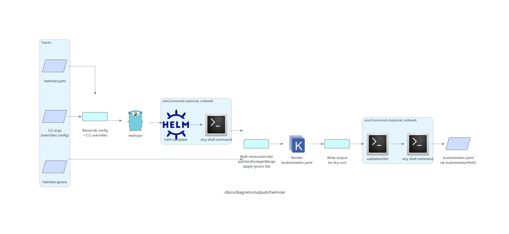

**Helmizer**

- [About](#about)
- [Usage](#usage)
  - [CLI](#cli)
- [Configuration](#configuration)
  - [Installation](#installation)
    - [Linux](#linux)
    - [Nix / NixOS](#nix--nixos)
    - [Docker](#docker)
      - [In your Docker Image](#in-your-docker-image)
    - [Windows](#windows)
  - [Run](#run)
  - [Examples](#examples)
- [GitHub Action](#github-action)
  - [Action Inputs](#action-inputs)
  - [Basic Usage](#basic-usage)
  - [Automated PR Regeneration with Renovate or Dependabot](#automated-pr-regeneration-with-renovate-or-dependabot)
    - [The Workflow](#the-workflow)
    - [How It Works](#how-it-works)
    - [Renovate Setup](#renovate-setup)
    - [Dependabot Setup](#dependabot-setup)
    - [Removing the Actor Filter](#removing-the-actor-filter)
- [GitLab CI](#gitlab-ci)
  - [Basic GitLab Usage](#basic-gitlab-usage)
  - [Automated MR Regeneration with Renovate](#automated-mr-regeneration-with-renovate)
    - [The Pipeline](#the-pipeline)
    - [GitLab Setup Notes](#gitlab-setup-notes)
    - [Triggering on All MRs](#triggering-on-all-mrs)
- [Kustomize Options](#kustomize-options)

---

# About

**TLDR**

Generates a `kustomization.yaml` file, optionally providing the ability to run commands (e.g. `helm template`) on your OS prior to generating a kustomization, and will compose the kustomization fields that deal with file paths (e.g. `resources`) with glob-like features, as well as pass-through all other kustomization configuration properties. No need to explicitly enumerate every file to be 'kustomized' individually.

`helmizer` takes a config file as input, telling **Helmizer** if you want to run any commands. Then if you give it one or more directories for `crds`/`components`/`patchesStrategicMerge`/`resources`, it will recursively lookup all of those files and render them into your kustomization.yaml. Want to skip including one file like `templates/secret.yaml`? Just add the relative path to `helmizer.ignore` to `helmizer.yaml`.

---

[Thou shall not _glob_](https://github.com/kubernetes-sigs/kustomize/issues/3205), said the **kustomize** developers (thus far).

**Helmizer** takes various inputs from a YAML config file (`helmizer.yaml` by default) and constructs a [kustomization file](https://kubernetes.io/docs/tasks/manage-kubernetes-objects/kustomization/) from those inputs. It can run a sequence of commands before rendering the kustomization file.

Instead of manually entering the paths to [`resources`](https://kubectl.docs.kubernetes.io/references/kustomize/resource/) in a kustomization file, this tool will walk any number of directories containing resources and populate the kustomization with these resources. Or only pull in individual files, it's your choice.

I began transitioning my `helm` charts to local manifests via [`helm template`](https://helm.sh/docs/helm/helm_template/), which were then applied to the cluster separately via [Kustomize](https://kustomize.io/). I didn't enjoy having to manually manage the relative paths to files in the **kustomization**. I wanted a repeatable process to generate **Kubernetes** manifests from a helm chart, _and_ tack on any patches or related resources later with a single command. Thus, **helmizer**. **But [Helm](https://helm.sh/) is in no way required to make this tool useful** - have it walk your raw manifests as well. This is just a wrapper that allows combining steps, and glob-like behavior, to managing `kustomization.yaml` files.

# Usage

## CLI

```
Usage: helmizer [--log-format LOG-FORMAT] [--log-level LOG-LEVEL] [--log-colors] [--api-version API-VERSION] [--dry-run] [--kustomization-path KUSTOMIZATION-PATH] [--quiet-commands] [--quiet-helmizer] [--skip-commands] [--skip-postcommands] [--skip-precommands] [--stop-on-error] [--config-glob CONFIG-GLOB] [CONFIGFILEPATH]

Positional arguments:
  CONFIGFILEPATH         Path to Helmizer config file (optional if --config-glob is set)

Options:
  --log-format LOG-FORMAT
                         Set log format: plain or JSON [default: plain]
  --log-level LOG-LEVEL, -l LOG-LEVEL
                         Set log level: INFO, DEBUG, ERROR, WARNING [default: INFO]
  --log-colors           Enables color in the log output [default: true]
  --api-version API-VERSION
                         Set the API version for the kustomization.yaml file [default: kustomize.config.k8s.io/v1beta1]
  --dry-run              Don't write the kustomization.yaml file. This does not affect pre/post commands [default: false]
  --kustomization-path KUSTOMIZATION-PATH
                         Set the path to write kustomization.yaml file [default: .]
  --quiet-commands, -q   Don't output stdout/stderr for pre and post command sequences [default: false]
  --quiet-helmizer       Don't output logs or the kustomization [default: false]
  --skip-commands        Skip executing pre and post command sequences [default: false]
  --skip-postcommands    Skip executing the post-command sequence [default: false]
  --skip-precommands     Skip executing the pre-command sequence [default: false]
  --stop-on-error        Stop execution on first error [default: true]
  --config-glob CONFIG-GLOB
                         Glob pattern(s) for Helmizer config files; supports ** and comma-separated values
  --help, -h             display this help and exit
  --version              display version and exit
```

Run against multiple configs with `--config-glob` instead of shelling out to `find`. Example:

```bash
helmizer --config-glob "**/helmizer.yaml"
```

You can also pass comma-separated patterns, for example: `--config-glob "apps/**/helmizer.yaml,clusters/**/helmizer.yaml"`.



# Configuration

- Example `helmizer.yaml` config file. The `helm` command is invoked before the content for `kustomization.yaml` is generated. Any number of commands can be added here.
```yaml
helmizer:
  apiVersion: "kustomize.config.k8s.io/v1beta1"
  dryRun: false
  ignore: []
  kustomizationPath: "."
  preCommands:
    - command: helm
      args:
        - '-n'
        - cert-manager
        - template
        - cert-manager
        - '--output-dir'
        - .
        - '--include-crds'
        - '--skip-tests'
        - '--version'
        - 1.19.2
        - jetstack/cert-manager
  postCommands:
    - command: pre-commit
      args:
        - run
        - '-a'
        - '||'
        - 'true'
  quietCommands: false
  skipAllCommands: false
  skipPostCommands: false
  skipPreCommands: false
kustomize:
  commonAnnotations: {}
  commonLabels: {}
  configMapGenerator: []
  crds: []
  generatorOptions: {}
  images: []
  namePrefix: ""
  namespace: ""
  nameSuffix: ""
  openapi: {}
  patches: []
  patchesJson6902: []
  patchesStrategicMerge: []
  replacements: []
  replicas: []
  resources: []
  secretGenerator: []
  vars: []
```

<details>
<summary>Click to expand this bit to see the above, but with explanations for the configuration properties</summary>

```yaml
helmizer:
  dryRun: false  # optional - if true, does not write to a filesystem
  ignore: []  # optional - list of files/directories to ignore
  kustomizationPath: "."  # optional - path to write kustomization.yaml
  preCommands:  # optional - list of commands/args executed serially. Inherits your $PATH
    - command: "helm"
      args:
        - "-n"
        - "cert-manager"
        - "template"
        - "cert-manager"
        - --output-dir
        - '.'
        - --include-crds
        - --skip-tests
        - --version
        - 1.19.2
        - jetstack/cert-manager
  postCommands:  # optional - list of commands/args executed serially. Inherits your $PATH
    - command: "pre-commit"
      args:
        - 'run'
        - '-a'
        - '||'
        - 'true'
  quietCommands: false
  skipAllCommands: false
  skipPostCommands: false
  skipPreCommands: false
  stopOnError: true
kustomize:  # this is essentially an overlay for your eventual kustomization.yaml
  buildMetadata: []
  commonAnnotations: {}
  commonLabels: {}
  configMapGenerator: []
  crds: []
  generatorOptions: {}
  helmCharts: []
  images: []
  labels: []
  namePrefix: ""
  namespace: ""
  nameSuffix: ""
  openapi: {}
  patches: []
  patchesJson6902: []
  patchesStrategicMerge: []
  replacements: []
  replicas: []
  resources: []
  secretGenerator: []
  sortOptions: {}
  vars: []
```

</details>

## Installation

### Linux

```bash
curl -L "https://github.com/DaemonDude23/helmizer/releases/download/v0.19.2/helmizer_0.19.2_linux_amd64.tar.gz" -o helmizer.tar.gz && \
tar -xzf helmizer.tar.gz helmizer && \
sudo mv helmizer /usr/local/bin/ && \
rm helmizer.tar.gz && \
sudo chmod +x /usr/local/bin/helmizer
```

### Nix / NixOS

Using the included flake:

```bash
# Build from the checked-out repo
mkdir -p ./build/nix
nix build .#default --out-link ./build/nix/helmizer
./build/nix/helmizer/bin/helmizer --version

# Run without installing
nix run github:daemondude23/helmizer -- helmizer.yaml

# Install to your user profile
nix profile add github:daemondude23/helmizer

# Drop into a dev shell
nix develop
```

To add to a NixOS or home-manager flake configuration:

```nix
# flake.nix inputs
inputs.helmizer.url = "github:daemondude23/helmizer";

# In your configuration (NixOS or home-manager)
environment.systemPackages = [
  inputs.helmizer.packages.${system}.default
];
```

### Docker

Two Dockerfiles are available:

- `Dockerfile`: minimal scratch image with just `helmizer`.
- `Dockerfile.helm`: alpine image with `helmizer` plus the Helm binary copied from `docker.io/alpine/helm:4.1.4`.

#### In your Docker Image

Minimal:

```dockerfile
# Builder stage
FROM ghcr.io/daemondude23/helmizer/helmizer:v0.19.2 AS builder

# Final minimal stage
FROM scratch
COPY --from=builder /usr/local/bin/helmizer /usr/local/bin/helmizer
```

With Helm:

```dockerfile
# Builder stage
FROM ghcr.io/daemondude23/helmizer/helmizer-helm:v0.19.2 AS builder

# Final minimal stage
FROM scratch
COPY --from=builder /usr/local/bin/helm /usr/local/bin/helm
COPY --from=builder /usr/local/bin/helmizer /usr/local/bin/helmizer
```

### Windows

1. Download the Windows version.
2. Untar it and put it in your `$PATH`.

## Run

**For greater detail on running the examples (they assume you've already run [helm template](https://helm.sh/docs/helm/helm_template/)), see the [resource example](examples/resources/README.md)**

Input file:

```yaml
helmizer:
  preCommands:
    - command: "helm"
      args:
        - "-n"
        - "cert-manager"
        - "template"
        - "cert-manager"
        - --output-dir
        - '.'
        - --include-crds
        - --skip-tests
        - --version
        - 1.19.2
        - jetstack/cert-manager
kustomize:
  namespace: cert-manager
  resources:
    - ./cert-manager/
```

Helmize-ify it:

```bash
helmizer ./examples/resources/helmizer.yaml
```

Output - enumerating the files within the specified directory:

```yaml
apiVersion: kustomize.config.k8s.io/v1beta1
kind: Kustomization
namespace: cert-manager
resources:
  - cert-manager/cainjector-deployment.yaml
  - cert-manager/cainjector-rbac.yaml
  - cert-manager/cainjector-serviceaccount.yaml
  - cert-manager/deployment.yaml
  - cert-manager/rbac.yaml
  - cert-manager/service.yaml
  - cert-manager/serviceaccount.yaml
  - cert-manager/startupapicheck-job.yaml
  - cert-manager/startupapicheck-rbac.yaml
  - cert-manager/startupapicheck-serviceaccount.yaml
  - cert-manager/webhook-deployment.yaml
  - cert-manager/webhook-mutating-webhook.yaml
  - cert-manager/webhook-rbac.yaml
  - cert-manager/webhook-service.yaml
  - cert-manager/webhook-serviceaccount.yaml
  - cert-manager/webhook-validating-webhook.yaml
```

## Examples

_With [vscode](https://code.visualstudio.com/) you can utilize the included [launch.json](.vscode/launch.json) to test these more quickly, or reference for your configuration._
The `cert-manager` **Helm** chart is used for examples for its small scope. Here's another.

- [buildMetadata](examples/buildMetadata/)
- [commonAnnotations](examples/commonAnnotations/)
- [commonLabels](examples/commonLabels/)
- [configMapGenerator](examples/configMapGenerator/)
- [crds](examples/crds/)
- [generatorOptions](examples/generatorOptions/)
- [helmCharts](examples/helmCharts/)
- [images](examples/images/)
- [labels](examples/labels/)
- [namePrefix](examples/namePrefix/)
- [namespace](examples/namespace/)
- [nameSuffix](examples/nameSuffix/)
- [openapi](examples/openapi/)
- [patches](examples/patches/)
- [patchesJson6902](examples/patchesJson6902/)
- [patchesStrategicMerge](examples/patchesStrategicMerge/)
- [replacements](examples/replacements/)
- [replicas](examples/replicas/)
- [resources](examples/resources/)
- [secretGenerator](examples/secretGenerator/)
- [sortOptions](examples/sortOptions/)
- [vars](examples/vars/)

---

Which looks easier to write/maintain through future chart updates for the **Prometheus Operator/kube-prometheus-stack**, this helmizer.yaml?

```yaml
helmizer:
  preCommands:
    - command: "helm"
      args:
        - "-n"
        - "cert-manager"
        - "template"
        - "cert-manager"
        - --output-dir
        - '..'
        - --include-crds
        - --skip-tests
        - --validate
        - --version
        - '1.19.2'
        - --values
        - 'values.yaml'
        - jetstack/cert-manager
kustomize:
  namespace: monitoring
  resources:
    - ./templates/
```

Or this `kustomization.yaml` which `helmizer` generated?

```yaml
apiVersion: kustomize.config.k8s.io/v1beta1
kind: Kustomization
namespace: cert-manager
resources:
  - cert-manager/cainjector-deployment.yaml
  - cert-manager/cainjector-rbac.yaml
  - cert-manager/cainjector-serviceaccount.yaml
  - cert-manager/deployment.yaml
  - cert-manager/rbac.yaml
  - cert-manager/service.yaml
  - cert-manager/serviceaccount.yaml
  - cert-manager/startupapicheck-job.yaml
  - cert-manager/startupapicheck-rbac.yaml
  - cert-manager/startupapicheck-serviceaccount.yaml
  - cert-manager/webhook-deployment.yaml
  - cert-manager/webhook-mutating-webhook.yaml
  - cert-manager/webhook-rbac.yaml
  - cert-manager/webhook-service.yaml
  - cert-manager/webhook-serviceaccount.yaml
  - cert-manager/webhook-validating-webhook.yaml
```

# GitHub Action

Helmizer is available as a GitHub Action. It uses the `Dockerfile.helm` image, which includes both `helmizer` and `helm`, so pre-commands that call `helm template` work out of the box.

## Action Inputs

| Input         | Required | Default          | Description                                                                          |
|---------------|----------|------------------|--------------------------------------------------------------------------------------|
| `config`      | No       | `helmizer.yaml`  | Path to a single helmizer config file, relative to the workspace.                    |
| `config_glob` | No       | `""`             | Glob pattern(s) for helmizer config files. Supports `**` and comma-separated values. |

When `config_glob` is set, the `config` positional argument is optional — if the default `helmizer.yaml` doesn't exist at the repo root, it is silently skipped.

## Basic Usage

Run helmizer against a single config:

```yaml
- uses: daemondude23/helmizer@v0.19.2
  with:
    config: path/to/helmizer.yaml
```

Run helmizer against all configs in the repo:

```yaml
- uses: daemondude23/helmizer@v0.19.2
  with:
    config_glob: "**/helmizer.yaml"
```

## Automated PR Regeneration with Renovate or Dependabot

A common pattern: use [Renovate](https://docs.renovatebot.com/) or [Dependabot](https://docs.github.com/en/code-security/dependabot) to automatically open PRs that bump helm chart versions or container image tags in your `helmizer.yaml` files, then run helmizer as a second step in that PR to regenerate `kustomization.yaml` with the updated versions.

### The Workflow

Add this workflow to your **GitOps/manifests repo** (the repo that contains your `helmizer.yaml` files):

```yaml
# .github/workflows/helmizer.yaml
name: Regenerate Kustomizations

on:
  pull_request:
    paths:
      - "**/helmizer.yaml"
      - "**/values.yaml"
      - "**/Chart.yaml"

jobs:
  helmizer:
    runs-on: ubuntu-latest
    # Only run on Renovate or Dependabot PRs
    if: >-
      github.actor == 'renovate[bot]' ||
      github.actor == 'dependabot[bot]'
    permissions:
      contents: write
    steps:
      - name: Checkout PR branch
        uses: actions/checkout@v4
        with:
          ref: ${{ github.head_ref }}
          fetch-depth: 0
          token: ${{ secrets.GITHUB_TOKEN }}

      - name: Find affected helmizer configs
        id: find-configs
        run: |
          # Get files changed in this PR
          changed_files=$(git diff --name-only origin/${{ github.base_ref }}...HEAD)

          # For each changed file, walk up to find the nearest helmizer.yaml
          configs=""
          for file in $changed_files; do
            dir=$(dirname "$file")
            while [ "$dir" != "." ] && [ "$dir" != "/" ]; do
              if [ -f "$dir/helmizer.yaml" ]; then
                configs="$configs $dir/helmizer.yaml"
                break
              fi
              dir=$(dirname "$dir")
            done
            # Also check repo root
            if [ -f "helmizer.yaml" ] && [ "$dir" = "." ]; then
              configs="$configs helmizer.yaml"
            fi
          done

          # Deduplicate
          configs=$(echo "$configs" | tr ' ' '\n' | sort -u | tr '\n' ',' | sed 's/,$//')
          echo "configs=$configs" >> "$GITHUB_OUTPUT"
          echo "Found helmizer configs: $configs"

      - name: Run Helmizer
        if: steps.find-configs.outputs.configs != ''
        uses: daemondude23/helmizer@v0.19.2
        with:
          config_glob: ${{ steps.find-configs.outputs.configs }}

      # Optional: run pre-commit hooks on regenerated files
      # Uncomment the following step if your repo uses pre-commit
      # - name: Run pre-commit hooks
      #   if: steps.find-configs.outputs.configs != ''
      #   uses: pre-commit/action@v3.0.1

      - name: Commit regenerated kustomization files
        if: steps.find-configs.outputs.configs != ''
        run: |
          git config user.name "github-actions[bot]"
          git config user.email "github-actions[bot]@users.noreply.github.com"
          git add -A "**/kustomization.yaml"
          git diff --staged --quiet || git commit -m "chore: regenerate kustomization files"
          git push
```

### How It Works

1. **Renovate/Dependabot opens a PR** bumping a helm chart version or container image tag in a `helmizer.yaml` (or `values.yaml`, etc.)
2. **This workflow triggers** on that PR because a helmizer-related file changed
3. **The workflow finds the nearest `helmizer.yaml`** by walking up the directory tree from each changed file — only the affected chart directories are processed, not the entire repo
4. **Helmizer runs** against only those configs — executing pre-commands (e.g. `helm template`) and regenerating `kustomization.yaml` files
5. **(Optional) Pre-commit hooks run** to lint/format the regenerated files
6. **The updated kustomization files are committed** back to the PR branch

### Renovate Setup

Renovate can detect version bumps in the `kustomization.yaml` files that helmizer generates (e.g. `helmCharts` versions, `images` tags). When it finds a newer version, it opens a PR updating those fields. The helmizer workflow then re-runs to regenerate the kustomization consistently.

For repos that also use `Chart.yaml` or `values.yaml`, Renovate can detect helm chart versions there too.

Example `.github/renovate.json` for your GitOps repo:

```json
{
  "$schema": "https://docs.renovatebot.com/renovate-schema.json",
  "extends": ["config:base"],
  "docker": {
    "enabled": true
  },
  "packageRules": [
    {
      "enabled": true,
      "managers": ["helm-requirements", "helm-values"],
      "matchFiles": ["**/Chart.yaml"]
    },
    {
      "enabled": true,
      "managers": ["kustomize"],
      "matchFiles": ["**/kustomization.yaml"]
    }
  ]
}
```

### Dependabot Setup

Dependabot does not natively parse `kustomization.yaml` for helm chart versions, but it can detect Docker image tags in Dockerfiles and GitHub Actions versions. For helm chart version bumps specifically, Renovate is the better choice as it has native support for helm and kustomize version detection.

Example `.github/dependabot.yml`:

```yaml
version: 2
updates:
  - package-ecosystem: docker
    directory: /
    schedule:
      interval: weekly
  - package-ecosystem: github-actions
    directory: /
    schedule:
      interval: weekly
```

### Removing the Actor Filter

The example workflow above restricts runs to Renovate and Dependabot PRs via the `if` condition. To run helmizer on _all_ PRs that touch helmizer-related files (including manual PRs), remove the `if` block:

```yaml
jobs:
  helmizer:
    runs-on: ubuntu-latest
    permissions:
      contents: write
    steps:
      # ... same steps as above
```

# GitLab CI

In GitLab, there is no `action.yml` equivalent — instead, use the helmizer Docker image directly in your `.gitlab-ci.yml` pipeline.

## Basic GitLab Usage

```yaml
# .gitlab-ci.yml
helmizer:
  image: ghcr.io/daemondude23/helmizer/helmizer:v0.19.2
  script:
    - helmizer --config-glob "**/helmizer.yaml"
```

If your helmizer configs use `helm template` in pre-commands, use the `helmizer-helm` image which bundles helm:

```yaml
helmizer:
  image: ghcr.io/daemondude23/helmizer/helmizer-helm:v0.19.2
  script:
    - helmizer --config-glob "**/helmizer.yaml"
```

## Automated MR Regeneration with Renovate

The same pattern as GitHub — Renovate opens a merge request bumping versions, then a pipeline job runs helmizer and commits the regenerated files back to that MR branch.

### The Pipeline

Add this to your **GitOps/manifests repo**:

```yaml
# .gitlab-ci.yml
stages:
  - regenerate

helmizer:
  stage: regenerate
  image: ghcr.io/daemondude23/helmizer/helmizer-helm:v0.19.2
  rules:
    # Only run on Renovate MR branches
    - if: $CI_PIPELINE_SOURCE == "merge_request_event" && $CI_MERGE_REQUEST_SOURCE_BRANCH_NAME =~ /^renovate\//
      changes:
        - "**/helmizer.yaml"
        - "**/values.yaml"
        - "**/Chart.yaml"
  before_script:
    - git config user.name "gitlab-ci"
    - git config user.email "gitlab-ci@${CI_SERVER_HOST}"
    - git remote set-url origin "https://gitlab-ci-token:${HELMIZER_TOKEN}@${CI_SERVER_HOST}/${CI_PROJECT_PATH}.git"
    - git fetch origin "$CI_MERGE_REQUEST_TARGET_BRANCH_NAME" "$CI_MERGE_REQUEST_SOURCE_BRANCH_NAME"
    - git checkout "$CI_MERGE_REQUEST_SOURCE_BRANCH_NAME"
  script:
    - |
      # Find helmizer configs affected by this MR
      changed_files=$(git diff --name-only "origin/${CI_MERGE_REQUEST_TARGET_BRANCH_NAME}...HEAD")
      configs=""
      for file in $changed_files; do
        dir=$(dirname "$file")
        while [ "$dir" != "." ] && [ "$dir" != "/" ]; do
          if [ -f "$dir/helmizer.yaml" ]; then
            configs="$configs $dir/helmizer.yaml"
            break
          fi
          dir=$(dirname "$dir")
        done
        if [ -f "helmizer.yaml" ] && [ "$dir" = "." ]; then
          configs="$configs helmizer.yaml"
        fi
      done
      configs=$(echo "$configs" | tr ' ' '\n' | sort -u | tr '\n' ',' | sed 's/,$//')
      echo "Found helmizer configs: $configs"
      if [ -n "$configs" ]; then
        helmizer --config-glob "$configs"

        # Optional: run pre-commit hooks on regenerated files
        # Uncomment the following lines if your repo uses pre-commit
        # pip install pre-commit
        # pre-commit run --all-files || true

        git add -A "**/kustomization.yaml"
        git diff --staged --quiet || git commit -m "chore: regenerate kustomization files"
        git push origin "$CI_MERGE_REQUEST_SOURCE_BRANCH_NAME"
      fi
```

### GitLab Setup Notes

- **`HELMIZER_TOKEN`**: Create a [project or group access token](https://docs.gitlab.com/ee/user/project/settings/project_access_tokens.html) with `write_repository` scope. Add it as a CI/CD variable. The default `CI_JOB_TOKEN` typically cannot push to protected branches.
- **Branch protection**: Ensure the `renovate/*` branch pattern is not protected, or allow the token to push to it.
- **Renovate on GitLab**: Renovate supports GitLab natively. You can run it as a [scheduled pipeline](https://docs.renovatebot.com/modules/platform/gitlab/) or use the Mend-hosted Renovate app. The same `renovate.json` config from the [Renovate Setup](#renovate-setup) section works on both GitHub and GitLab.

### Triggering on All MRs

To run on all merge requests (not just Renovate), simplify the rules:

```yaml
  rules:
    - if: $CI_PIPELINE_SOURCE == "merge_request_event"
      changes:
        - "**/helmizer.yaml"
        - "**/values.yaml"
        - "**/Chart.yaml"
  ```

# Kustomize Options

- [Kustomize Docs](https://kubectl.docs.kubernetes.io/references/kustomize/)

All `kustomize` configuration options which are not deprecated by `kustomize` are supported. See [here](https://kubectl.docs.kubernetes.io/references/kustomize/kustomization/) for reference.
