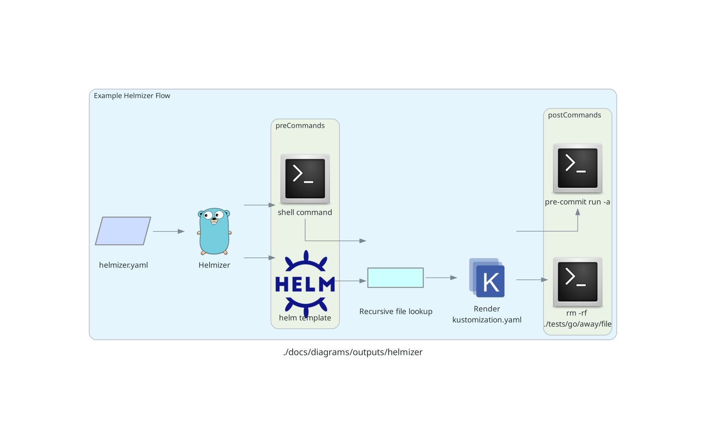

**Helmizer**

- [About](#about)
- [Usage](#usage)
  - [CLI](#cli)
- [Configuration](#configuration)
  - [Installation](#installation)
    - [Linux](#linux)
    - [Docker](#docker)
      - [In your Docker Image](#in-your-docker-image)
    - [Windows](#windows)
  - [Run](#run)
  - [Examples](#examples)
- [Kustomize Options](#kustomize-options)

---

# About

**TLDR**

Generates a `kustomization.yaml` file, optionally providing the ability to run commands (e.g. `helm template`) on your OS prior to generating a kustomization, and will compose the kustomization fields that deal with file paths (e.g. `resources`) with glob-like features, as well as pass-through all other kustomization configuration properties. No need to explicitly enumerate every file to be 'kustomized' individually.

`helmizer` takes a config file as input, telling **Helmizer** if you want to run any commands. Then if you give it one or more directories for `crds`/`components`/`patchesStrategicMerge`/`resources`, it will recursively lookup all of those files and render them into your kustomization.yaml. Want to skip including one file like `templates/secret.yaml`? Just add the relative path to `helmizer.ignore` to `helmizer.yaml`.

---

[Thou shall not _glob_](https://github.com/kubernetes-sigs/kustomize/issues/3205), said the **kustomize** developers (thus far).

**Helmizer** takes various inputs from a YAML config file (`helmizer.yaml` by default) and constructs a [kustomization file](https://kubernetes.io/docs/tasks/manage-kubernetes-objects/kustomization/) from those inputs. It can run a sequence of commands before rendering the kustomization file.

Instead of manually entering the paths to [`resources`](https://kubectl.docs.kubernetes.io/references/kustomize/resource/) in a kustomization file, this tool will walk any number of directories containing resources and populate the kustomization with these resources. Or only pull in individual files, it's your choice.

I began transitioning my `helm` charts to local manifests via [`helm template`](https://helm.sh/docs/helm/helm_template/), which were then applied to the cluster separately via [Kustomize](https://kustomize.io/). I didn't enjoy having to manually manage the relative paths to files in the **kustomization**. I wanted a repeatable process to generate **Kubernetes** manifests from a helm chart, _and_ tack on any patches or related resources later with a single command. Thus, **helmizer**. **But [Helm](https://helm.sh/) is in no way required to make this tool useful** - have it walk your raw manifests as well. This is just a wrapper that allows combining steps, and glob-like behavior, to managing `kustomization.yaml` files.

# Usage

## CLI

```
Usage: helmizer [--log-format LOG-FORMAT] [--log-level LOG-LEVEL] [--log-colors] [--api-version API-VERSION] [--dry-run] [--kustomization-path KUSTOMIZATION-PATH] [--quiet-commands] [--quiet-helmizer] [--skip-commands] [--skip-postcommands] [--skip-precommands] [--stop-on-error] CONFIGFILEPATH

Positional arguments:
  CONFIGFILEPATH         Path to Helmizer config file

Options:
  --log-format LOG-FORMAT
                         Set log format: plain or JSON [default: plain]
  --log-level LOG-LEVEL, -l LOG-LEVEL
                         Set log level: INFO, DEBUG, ERROR, WARNING [default: INFO]
  --log-colors           Enables color in the log output [default: true]
  --api-version API-VERSION
                         Set the API version for the kustomization.yaml file [default: kustomize.config.k8s.io/v1beta1]
  --dry-run              Don't write the kustomization.yaml file. This does not affect pre/post commands [default: false]
  --kustomization-path KUSTOMIZATION-PATH
                         Set the path to write kustomization.yaml file [default: .]
  --quiet-commands, -q   Don't output stdout/stderr for pre and post command sequences [default: false]
  --quiet-helmizer       Don't output logs or the kustomization [default: false]
  --skip-commands        Skip executing pre and post command sequences [default: false]
  --skip-postcommands    Skip executing the post-command sequence [default: false]
  --skip-precommands     Skip executing the pre-command sequence [default: false]
  --stop-on-error        Stop execution on first error [default: true]
  --help, -h             display this help and exit
  --version              display version and exit
```



# Configuration

- Example `helmizer.yaml` config file. The `helm` command is invoked before the content for `kustomization.yaml` is generated. Any number of commands can be added here.
```yaml
helmizer:
  apiVersion: "kustomize.config.k8s.io/v1beta1"
  dryRun: false
  ignore: []
  kustomizationPath: "."
  preCommands:
    - command: helm
      args:
        - '-n'
        - cert-manager
        - template
        - cert-manager
        - '--output-dir'
        - .
        - '--include-crds'
        - '--skip-tests'
        - '--version'
        - 1.14.3
        - jetstack/cert-manager
  postCommands:
    - command: pre-commit
      args:
        - run
        - '-a'
        - '||'
        - 'true'
  quietCommands: false
  skipCommands: false
  skipPostCommands: false
  skipPreCommands: false
kustomize:
  commonAnnotations: {}
  commonLabels: {}
  configMapGenerator: []
  crds: []
  generatorOptions: {}
  images: []
  namePrefix: []
  namespace: ""
  nameSuffix: []
  openapi: {}
  patches: []
  patchesJson6902: []
  patchesStrategicMerge: []
  replacements: []
  replicas: []
  resources: []
  secretGenerator: []
  vars: []
```

<details>
<summary>Click to expand this bit to see the above, but with explanations for the configuration properties</summary>

```yaml
helmizer:
  dryRun: false  # optional - if true, does not write to a filesystem
  ignore: []  # optional - list of files/directories to ignore
  kustomizationPath: "yaml"  # optional - 'yaml' or 'yml'
  preCommands:  # optional - list of commands/args executed serially. Inherits your $PATH
    - command: "helm"
      args:
        - "-n"
        - "cert-manager"
        - "template"
        - "cert-manager"
        - --output-dir
        - '.'
        - --include-crds
        - --skip-tests
        - --version
        - 1.14.3
        - jetstack/cert-manager
  postCommands:  # optional - list of commands/args executed serially. Inherits your $PATH
    - command: "pre-commit"
      args:
        - 'run'
        - '-a'
        - '||'
        - 'true'
  quietCommands: false
  skipCommands: false
  skipPostCommands: false
  skipPreCommands: false
  stopOnError: true
kustomize:  # this is essentially an overlay for your eventual kustomization.yaml
  commonAnnotations: {}
  commonLabels: {}
  configMapGenerator: []
  crds: []
  generatorOptions: {}
  images: []
  namePrefix: []
  namespace: ""
  nameSuffix: []
  openapi: {}
  patches: []
  patchesJson6902: []
  patchesStrategicMerge: []
  replacements: []
  replicas: []
  resources: []
  secretGenerator: []
  vars: []
```

</details>

## Installation

### Linux

```bash
curl -L "https://github.com/DaemonDude23/helmizer/releases/download/v0.16.0/helmizer_0.16.0_linux_amd64.tar.gz" -o helmizer.tar.gz && \
tar -xzf helmizer.tar.gz helmizer && \
sudo mv helmizer /usr/local/bin/ && \
rm helmizer.tar.gz && \
sudo chmod +x /usr/local/bin/helmizer
```

### Docker

#### In your Docker Image

```dockerfile
# Builder stage
FROM ghcr.io/DaemonDude23/helmizer:v0.16.0 AS builder

# Final minimal stage
FROM scratch
COPY --from=builder /usr/local/bin/helmizer /usr/local/bin/helmizer
```

### Windows

1. Download the Windows version.
2. Untar it and put it in your `$PATH``.

## Run

**For greater detail on running from examples (they assumes you've ran [helm template](https://helm.sh/docs/helm/helm_template/), see the [resource example](examples/resources/README.md))**

Input file:
```yaml
helmizer:
  preCommands:
    - command: "helm"
      args:
        - "-n"
        - "cert-manager"
        - "template"
        - "cert-manager"
        - --output-dir
        - '.'
        - --include-crds
        - --skip-tests
        - --version
        - 1.14.3
        - jetstack/cert-manager
kustomize:
  namespace: cert-manager
  resources:
    - ./cert-manager/
```

Helmize-ify it:
```bash
helmizer ./examples/resources/helmizer.yaml
```

Output - enumerating the files within the specified directory:
```yaml
apiVersion: kustomize.config.k8s.io/v1beta1
kind: Kustomization
namespace: cert-manager
resources:
  - cert-manager/cainjector-deployment.yaml
  - cert-manager/cainjector-rbac.yaml
  - cert-manager/cainjector-serviceaccount.yaml
  - cert-manager/deployment.yaml
  - cert-manager/rbac.yaml
  - cert-manager/service.yaml
  - cert-manager/serviceaccount.yaml
  - cert-manager/startupapicheck-job.yaml
  - cert-manager/startupapicheck-rbac.yaml
  - cert-manager/startupapicheck-serviceaccount.yaml
  - cert-manager/webhook-deployment.yaml
  - cert-manager/webhook-mutating-webhook.yaml
  - cert-manager/webhook-rbac.yaml
  - cert-manager/webhook-service.yaml
  - cert-manager/webhook-serviceaccount.yaml
  - cert-manager/webhook-validating-webhook.yaml
```

## Examples

_With [vscode](https://code.visualstudio.com/) you can utilize the included [launch.json](.vscode/launch.json) to test these more quickly, or reference for your configuration._
The `cert-manager` **Helm** chart is used for examples for its small scope. Here's another.

- [commonAnnotations](examples/commonAnnotations/)
- [commonLabels](examples/commonLabels/)
- [configMapGenerator](examples/configMapGenerator/)
- [crds](examples/crds/)
- [generatorOptions](examples/generatorOptions/)
- [images](examples/images/)
- [namePrefix](examples/namePrefix/)
- [namespace](examples/namespace/)
- [nameSuffix](examples/nameSuffix/)
- [openapi](examples/openapi/)
- [patches](examples/patches/)
- [patchesJson6902](examples/patchesJson6902/)
- [patchStrategicMerge](examples/patchesStrategicMerge/)
- [replacements](examples/replacements/)
- [resources](examples/resources/)
- [secretGenerator](examples/secretGenerator/)
- [vars](examples/vars/)

---

Which looks easier to write/maintain through future chart updates for the [Prometheus Operator/kube-prometheus-stack](), this helmizer.yaml?


```yaml
helmizer:
  preCommands:
    - command: "helm"
      args:
        - "-n"
        - "cert-manager"
        - "template"
        - "cert-manager"
        - --output-dir
        - '..'
        - --include-crds
        - --skip-tests
        - --validate
        - --version
        - '1.14.3'
        - --values
        - 'values.yaml'
        - jetstack/cert-manager
kustomize:
  namespace: monitoring
  resources:
    - ./templates/
```

Or this `kustomization.yaml` which `helmizer` generated?

```yaml
apiVersion: kustomize.config.k8s.io/v1beta1
kind: Kustomization
namespace: cert-manager
resources:
  - cert-manager/cainjector-deployment.yaml
  - cert-manager/cainjector-rbac.yaml
  - cert-manager/cainjector-serviceaccount.yaml
  - cert-manager/deployment.yaml
  - cert-manager/rbac.yaml
  - cert-manager/service.yaml
  - cert-manager/serviceaccount.yaml
  - cert-manager/startupapicheck-job.yaml
  - cert-manager/startupapicheck-rbac.yaml
  - cert-manager/startupapicheck-serviceaccount.yaml
  - cert-manager/webhook-deployment.yaml
  - cert-manager/webhook-mutating-webhook.yaml
  - cert-manager/webhook-rbac.yaml
  - cert-manager/webhook-service.yaml
  - cert-manager/webhook-serviceaccount.yaml
  - cert-manager/webhook-validating-webhook.yaml
```

# Kustomize Options

- [Kustomize Docs](https://kubectl.docs.kubernetes.io/references/kustomize/)

All `kustomize` configuration options which are not deprecated by `kustomize` are supported. See [here](https://kubectl.docs.kubernetes.io/references/kustomize/kustomization/) for reference.
